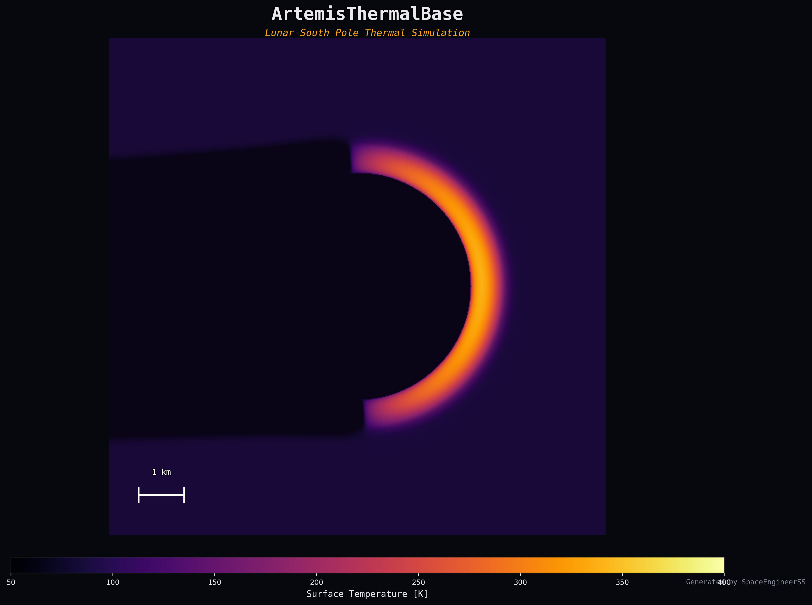

<p align="center">
  
</p>

<h1 align="center">🌙 ArtemisThermalBase</h1>

<p align="center">
  <strong>High-Fidelity Lunar South Pole Micro-Illumination & Thermal Raytracer</strong>
</p>

<p align="center">
  <a href="https://www.python.org/downloads/"></a>
  <a href="LICENSE"></a>
  <a href="https://github.com/SpaceEngineerSS/ArtemisThermalBase"></a>
  <a href="https://github.com/SpaceEngineerSS"></a>
</p>

---

## Abstract

> A high-fidelity lunar surface thermal simulation engine using **BVH-accelerated raytracing** and **Crank-Nicolson heat diffusion solvers** to model **Permanently Shadowed Regions (PSRs)** and **Cold Traps** for the Artemis program. The engine resolves penumbral illumination from the extended solar disk, computes subsurface heat conduction through temperature-dependent regolith properties, and produces publication-quality thermal maps validated against LRO Diviner observations.

---

## Key Features

| Feature | Description |
|---------|-------------|
| 🌞 **Extended Solar Source** | Penumbra modeling with 32-sample Monte Carlo integration across the solar disk (~0.533° angular diameter) |
| 🧱 **Real NASA Data Support** | Ingest LRO LOLA GeoTIFF DEMs via `rasterio` with automatic NoData masking and coordinate centering |
| 🌡️ **1D Subsurface Heat Diffusion** | Crank-Nicolson implicit solver with Newton iteration for radiative surface boundary condition |
| 🔬 **Temperature-Dependent Properties** | Regolith conductivity `k(T) = k_c + k_r·T³` and polynomial heat capacity following Hayne et al. (2017) |
| 🚀 **GPU-Ready Architecture** | Numba JIT-compiled raytracer with SAH-optimized BVH (4-leaf max, 16 SAH bins) |
| 📊 **Publication-Quality Output** | Automatic hero image generation with thermal-optical compositing, colorbars, and scale bars |

---

## Physical Model

### Surface Energy Balance

At each triangular DEM facet, the surface energy balance is:

```
(1 − A) · S₀ · cos(θ) · f_illum + Q_IR + Q_geo = ε · σ · T_s⁴ − k(T) · ∂T/∂z |_{z=0}
```

where:
- `A` = Bond albedo (0.12)
- `S₀` = Solar constant (1361 W/m²)
- `f_illum` = Illumination factor [0, 1] from raytracing
- `ε` = Thermal emissivity (0.95)
- `σ` = Stefan-Boltzmann constant

### Subsurface Heat Diffusion

```
ρ(z) · cₚ(T) · ∂T/∂t = ∂/∂z [k(T) · ∂T/∂z]
```

Solved with a Crank-Nicolson implicit scheme on a geometrically stretched grid (20 layers, 2 m deep), with Newton iteration for the nonlinear radiative upper boundary condition.

---

## Quick Start

### Installation

```bash
# Clone repository
git clone https://github.com/SpaceEngineerSS/ArtemisThermalBase.git
cd ArtemisThermalBase

# Install dependencies
pip install -e ".[dev]"
```

### Run a Simulation

```bash
# Basic run with synthetic crater (24 hours, default config)
python main.py --duration 24

# Faster test run with smaller crater
python main.py --cratersize 500 --duration 1 --point-source --dt 600

# High-fidelity run (2.5 km crater, 6 hours, penumbra enabled)
python main.py --cratersize 2500 --duration 6 --dt 300 --output-interval 1800
```

### Use Real NASA LOLA Data

```bash
# Generate a semi-synthetic Shackleton DEM (if no real data available)
python tools/download_sample_data.py --synthetic --grid-size 501

# Run simulation with GeoTIFF DEM
python main.py --dem data/sample_lola_dem.tif --duration 6 --point-source
```

### Re-Render Hero Image

```bash
# Re-render from saved data (no physics re-computation)
python main.py --render-only --output output --hero-dpi 600
```

### Run Tests

```bash
python -m pytest tests/ -v
```

---

## 📚 Documentation

Detailed scientific and technical documentation is available in the `docs/` directory:

| Document | Description |
| :--- | :--- |
| 📘 **[Physics Model](docs/PHYSICS_MODEL.md)** | Full mathematical derivation of the Surface Energy Balance, Crank-Nicolson discretization, and Raytracing algorithms. |
| ⚙️ **[Configuration Guide](docs/CONFIGURATION.md)** | Comprehensive guide to `default_config.yaml` parameters, valid ranges, and physical implications. |
| ⚠️ **[Assumptions & Limitations](docs/ASSUMPTIONS_AND_LIMITATIONS.md)** | Registry of all physical assumptions, known limitations (e.g., lack of multi-bounce IR), and their impact. |
| 🔌 **[API Reference](docs/API_REFERENCE.md)** | Developer documentation for `SimulationRunner`, `CrankNicolsonSolver`, and other core modules. |

---

## Architecture

```
ArtemisThermalBase/
├── config/                     # YAML simulation parameters
│   └── default_config.yaml     # All physical constants & solver settings
├── core_engine/                # Raytracing, mesh, illumination
│   ├── raytracer.py            # BVH + Möller-Trumbore intersection
│   ├── mesh.py                 # DEM → triangle mesh conversion
│   ├── illumination.py         # Solar visibility + penumbra
│   └── constants.py            # Config loader & dataclasses
├── data_ingestion/             # DEM loading, coordinates, ephemeris
│   ├── synthetic_dem.py        # Parametric crater generator
│   ├── lola_loader.py          # NASA LRO LOLA GeoTIFF loader
│   ├── ephemeris.py            # Skyfield sun position
│   └── coordinate_utils.py    # Selenographic ↔ local transforms
├── thermal_solver/             # Heat equation solver
│   ├── crank_nicolson.py       # CN implicit solver + Newton BC
│   ├── regolith_properties.py  # Hayne et al. (2017) properties
│   └── grid.py                 # Geometric subsurface grid
├── simulation/                 # Orchestration
│   ├── runner.py               # Main simulation loop
│   └── io_manager.py           # NumPy data persistence
├── visualization/              # Output rendering
│   ├── plotter.py              # Debug / analysis plots
│   └── hero_renderer.py        # Cinematic composite renderer
├── tools/                      # Standalone utilities
│   └── download_sample_data.py # LOLA data downloader
├── tests/                      # Pytest suite
├── main.py                     # CLI entry point
└── pyproject.toml              # Package configuration
```

---

## CLI Reference

| Argument | Default | Description |
|----------|---------|-------------|
| `--config` | `config/default_config.yaml` | Path to simulation config YAML |
| `--cratersize` | from config | Override crater radius [m] |
| `--duration` | `24.0` | Simulation duration [hours] |
| `--dt` | from config | Time step [seconds] |
| `--dem` | — | Path to GeoTIFF DEM (bypasses synthetic) |
| `--output` | `output/` | Output directory |
| `--output-interval` | `3600.0` | Snapshot interval [seconds] |
| `--point-source` | `false` | Fast mode (no penumbra) |
| `--render-only` | `false` | Re-render hero image from saved data |
| `--hero-dpi` | `300` | Hero image resolution |
| `--log-level` | `INFO` | Logging verbosity |

---

## Milestones

| # | Deliverable | Status |
|---|-------------|--------|
| 1 | Synthetic crater + BVH raytracer + CN thermal solver | ✅ Complete |
| 1.5 | Hero renderer + data persistence + `--render-only` | ✅ Complete |
| 2 | Real NASA LRO LOLA data pipeline + `--dem` flag | ✅ Complete |
| 3 | C++ BVH raytracer with pybind11 | ⬜ Planned |
| 4 | Multi-bounce IR radiation + view factors | ⬜ Planned |
| 5 | Diviner validation + documentation | ⬜ Planned |

---

## Sample Output

After running a 6-hour simulation on a 2.5 km synthetic crater:

```
Duration: 6.0 hours (72 steps)
Wall time: 1234.8 s
Final T: min=88.4 K, max=337.7 K, mean=100.5 K
Output files: illumination_map.png, thermal_map.png, time_series.png,
              sun_elevation.png, hero_artemis.png
```

The output includes 8 raw data files (NumPy `.npy` + metadata JSON) enabling re-rendering without re-running the physics.

---

## Citation

If you use ArtemisThermalBase in your research, please cite:

```bibtex
@software{artemis_thermal_base_2026,
  author       = {Gumus, Mehmet},
  title        = {ArtemisThermalBase: High-Fidelity Lunar South Pole Thermal Simulation},
  year         = {2026},
  url          = {https://github.com/SpaceEngineerSS/ArtemisThermalBase},
  version      = {0.1.0}
}
```

---

## References

1. Paige, D.A., et al. (2010). "Diviner Lunar Radiometer observations of cold traps in the Moon's south polar region." *Science*, 330, 479-482.
2. Hayne, P.O., et al. (2017). "Global regolith thermophysical properties of the Moon from the Diviner Lunar Radiometer Experiment." *JGR Planets*, 122, 2371-2400.
3. Mazarico, E., et al. (2011). "Illumination conditions of the lunar polar regions using LOLA topography." *Icarus*, 211, 1066-1081.
4. Vasavada, A.R., et al. (1999). "Near-surface temperatures on Mercury and the Moon and the stability of polar ice deposits." *Icarus*, 141, 179-193.
5. Zuber, M.T., et al. (2012). "Constraints on the volatile distribution within Shackleton crater at the Moon's south pole." *Nature*, 486, 378-381.
6. Möller, T. & Trumbore, B. (1997). "Fast, minimum storage ray-triangle intersection." *J. Graphics Tools*, 2(1), 21-28.
7. Smith, D.E., et al. (2017). "Summary of the results from the Lunar Orbiter Laser Altimeter after seven years in lunar orbit." *Icarus*, 283, 70-91.

---

## License

MIT License — see [LICENSE](LICENSE) for details.

---

<p align="center">
  <strong>Author:</strong> Mehmet Gümüş · <a href="https://github.com/SpaceEngineerSS">github.com/SpaceEngineerSS</a>
</p>
