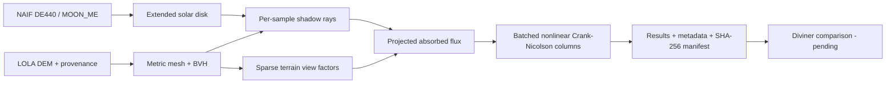

<p align="center">
  
</p>

<h1 align="center">ArtemisThermalBase</h1>

<p align="center">
  <a href="https://github.com/SpaceEngineerSS/ArtemisThermalBase/actions"></a>
  <a href="https://www.python.org/downloads/"></a>
  <a href="LICENSE"></a>
  <a href="CITATION.cff"></a>
</p>

<p align="center"><em>The header image is an illustrative synthetic preview, not a LOLA/Diviner validation product.</em></p>

Version 0.4.0 - open-source lunar south-pole illumination and thermal simulation with
BVH-accelerated ray tracing, an implicit subsurface heat solver, real LOLA
topography support, and NAIF/JPL lunar geometry.

> Scientific status: the implementation has provenance, numerical, and
> integration checks, but quantitative LRO Diviner validation is not complete.
> See [Validation Status](docs/VALIDATION_STATUS.md) before interpreting results.

## Capabilities

- Equal-solid-angle extended-Sun sampling with per-sample projected irradiance,
  terrain shadows, and penumbra.
- Pinned NAIF DE440 kernels evaluated in the lunar `MOON_ME` frame with `LT+S`
  aberration correction; kernel hashes are stored with results.
- LRO LOLA GeoTIFF scale/offset handling, lunar metric CRS checks, NoData
  processing, and SHA-256 provenance sidecars.
- Nonlinear Crank–Nicolson 1-D regolith columns with temperature/depth-dependent
  properties and geothermal heat applied once at the lower boundary.
- Dense batched Numba execution, memory preflight, Hapke reflectance,
  roughness-adjusted emissivity, one-bounce terrain IR, and spin-up convergence.
- A fail-closed research mode that rejects synthetic/unverified DEMs, missing
  kernels, analytical ephemeris fallbacks, and insufficient spin-up.
- A `checksums.sha256` manifest for every persisted simulation result bundle.

## Installation

```bash
git clone https://github.com/SpaceEngineerSS/ArtemisThermalBase.git
cd ArtemisThermalBase
python -m pip install -e ".[dev]"
```

Python 3.11 or newer is required.

## Fast preview

The default configuration is deliberately synthetic and suitable for software
tests, demonstrations, and performance work—not scientific claims.

```bash
python main.py --duration 6
python main.py --cratersize 500 --duration 1 --point-source --dt 600
```

Synthetic terrain is never selected automatically when a real-data download
fails. It must be requested explicitly.

## Research workflow

Fetch the four pinned NAIF inputs and create a SHA-256 lock:

```bash
python tools/fetch_research_data.py --group ephemeris
```

Prepare a metric, provenance-tracked LOLA window. The remote source is a large
classic GeoTIFF, so using a previously downloaded local source is preferable on
limited-bandwidth connections.

```bash
python tools/prepare_lola_dem.py \
  --output data/processed/shackleton_lola_240m.tif \
  --extent-km 30 --resolution-m 240
```

Audit the DEM hash/CRS/relief and SPICE geometry:

```bash
python -m validation.check_research_readiness \
  --dem data/processed/shackleton_lola_240m.tif
```

Run the research configuration:

```bash
python main.py \
  --config config/research_shackleton.yaml \
  --dem data/processed/shackleton_lola_240m.tif \
  --duration 708.734 --output output/research_shackleton
```

This is intentionally expensive: the configuration uses 64 Sun-disk samples,
512 view-factor rays, a 120 s timestep, and three lunar spin-up cycles. A paper
or dataset release must also include convergence sweeps; one run is not evidence
of numerical convergence.

## Surface and subsurface model

For each facet, absorbed sunlight is integrated over visible solar samples:

```text
Q_solar = (1 - A) S(t) mean_disk[max(0, n·s) V(s)]
```

`V(s)` is the binary terrain visibility for sample direction `s`. The surface
boundary includes absorbed solar flux and terrain IR; geothermal flux enters at
the bottom boundary. The subsurface equation is:

```text
ρ(z) cp(T) ∂T/∂t = ∂/∂z [k(T,z) ∂T/∂z]
```

The default vertical grid has 100 geometrically stretched layers and is about
6.19 m deep. Full equations and implementation assumptions are in
[Physics Model](docs/PHYSICS_MODEL.md).

## Model architecture


```mermaid
flowchart LR
    LOLA["LOLA DEM + provenance"] --> Mesh["Metric mesh + BVH"]
    NAIF["NAIF DE440 / MOON_ME"] --> Sun["Extended solar disk"]
    Sun --> Rays["Per-sample shadow rays"]
    Mesh --> Rays
    Rays --> Flux["Projected absorbed flux"]
    Mesh --> VF["Sparse terrain view factors"]
    VF --> Flux
    Flux --> CN["Batched nonlinear Crank-Nicolson columns"]
    CN --> Output["Results + metadata + SHA-256 manifest"]
    Output --> Diviner["Diviner comparison - pending"]
```

The preview path may substitute synthetic terrain and solar motion. The research
path requires the LOLA and NAIF inputs shown above and fails closed if their
provenance cannot be established.

## Quality gates

```bash
python -m pytest
python -m ruff check .
python -m mypy core_engine data_ingestion simulation thermal_solver validation main.py
```

CI runs the same gates on pushes and pull requests.

## Documentation

- [Research data sources](docs/DATA_SOURCES.md)
- [Reproducibility workflow](docs/REPRODUCIBILITY.md)
- [Scientific validation status](docs/VALIDATION_STATUS.md)
- [Physics model](docs/PHYSICS_MODEL.md)
- [Configuration guide](docs/CONFIGURATION.md)
- [Assumptions and limitations](docs/ASSUMPTIONS_AND_LIMITATIONS.md)
- [API reference](docs/API_REFERENCE.md)
- [Remediation plan](docs/REMEDIATION_PLAN.md)
- [ADR-001: batched CPU core](docs/architecture/adr-001-batched-cpu-simulation-core.md)
- [ADR-002: fail-closed research mode](docs/architecture/adr-002-fail-closed-research-mode.md)

## Data and validation policy

Large kernels, DEMs, and generated outputs are excluded from Git. Manifests,
hash locks, preparation code, configurations, and validation reports provide the
reproduction trail. The intended observational reference is LRO Diviner. PDS
missing brightness temperatures (`-9999`) are excluded, but footprint/channel/
geometry matching is still pending; this repository therefore does not claim
Diviner validation.

## Citation

Citation metadata is provided in [CITATION.cff](CITATION.cff). Please also cite
the LOLA, NAIF/JPL, Diviner, and physical-property sources appropriate to your
run, as listed in [Research Data Sources](docs/DATA_SOURCES.md).

## License

[MIT](LICENSE)
